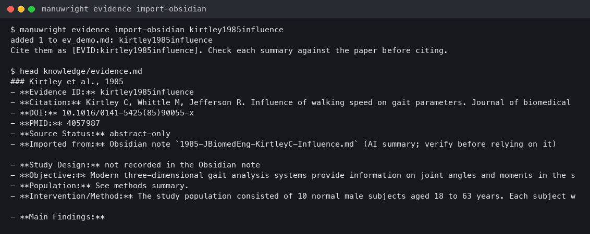

<p align="center">
  <picture>
    <source media="(prefers-color-scheme: dark)" srcset="assets/logo-dark.png">
    
  </picture>
</p>

<h1 align="center">manuwright</h1>

<p align="center">
  <em>没登记过的论文，他绝不让你引用。</em>
</p>

<p align="center">
  <a href="https://github.com/grotyx/Academic_writing_c_claudecode/actions/workflows/tests.yml"></a>
  
  
  
  
</p>

<p align="center">
  <strong>先定计划 &middot; 每条引用都来自登记的证据 &middot; 每个数字都来自数据 &middot; 投稿前过门禁</strong><br>
  <sub>面向 AI 智能体的医学论文写作流程。Claude Code、Codex、Antigravity、opencode、Muse 共用一个验证引擎。</sub>
</p>

<p align="center">
  <sub><a href="README.md">English</a> &middot; <a href="README.ko.md">한국어</a> &middot; <a href="README.ja.md">日本語</a></sub>
</p>

---

想想每个好实验室里都有的那位资深作者。他拿着笔读初稿，圈出一句话，轻声问：*"这是哪篇论文说的？"* 圈出一个数字：*"哪张表？"* 他签字之前，什么都不会离开实验室。

manuwright 把这个人放进你的 AI 智能体里。

## 使用前 / 使用后

计划还没定，你就让智能体去写 Results。

没有 manuwright 时，它会写出流畅的文字，引用一篇看似可信却不存在的论文，再把一个它从没读过的均值四舍五入写进去。

有了 manuwright：

```text
BLOCKED by workflow gate (Rule 8): drafts/draft_plan.md has not been approved.
Create the draft plan first, get author approval, then draft sections.
```

计划获批之后，每一条论断仍要通过检查器。

```text
$ manuwright citations drafts/03_introduction.md
GATE FAIL
citation: EVID:smith_2021
reason: citation id not found in knowledge/evidence.md

$ manuwright numbers drafts/05_results.md
GATE FAIL
number: 54.3
reason: number not found in results CSV files
```

## 工作方式

```text
 evidence.md   ┐
 results/*.csv ┼──▶ approved plan ──▶ draft ──▶ gates ──▶ QC ×3 ──▶ signed build
 style spec    ┘                                  ├ citations
                          ▲                       ├ numbers
                    hooks block                   └ semantic review (independent)
                    writes without it
```

| 保证 | 由谁强制 |
|---|---|
| draft plan 获批前不能写章节，analysis plan 获批前不能写分析代码 | 智能体 hook（Claude Code、Codex）与 `manuwright verify` |
| 每个 `[EVID:id]` 都以已验证来源登记在 `knowledge/evidence.md` 中 | `manuwright citations` |
| 报告的每个数字都存在于 `results/*.csv` | `manuwright numbers` 与 result binding |
| 来源、计划或引擎变化时，评审即变为 stale | 每条记录中的 sha256 快照 |
| 投稿需要人工签字、AI 使用声明和完成的检查清单 | `manuwright verify --profile submission` |
| 文字读起来像高影响力临床期刊，而不是聊天机器人 | 学术文体模式：每次起草提供风格卡，每次编辑检查文字（`strict` 会阻止） |

引擎从不编造批准或评审，只记录人做出的决定。

## 学术文体模式

让代理从初稿起就用医学期刊的文体写作，而不是聊天机器人的腔调。基准来自 2019–2022 年（生成式 AI 之前）JAMA Surgery、JAMA Network Open、Lancet、BMJ 和 Nature 的 33 篇开放许可原创研究的测量值。只发布数字（`docs/academic_style/reference_profile.json`），论文原文不上传 GitHub。例如 "used" 出现 345 次，"utilized" 仅 1 次；delve、underscore、"plays a crucial role" 一次也没有出现。

在对话中直接提出即可。

| 这样说 | 会发生什么 |
|---|---|
| "写 Introduction"、"重写 Discussion" | 读取该章节卡片（结构、表达库、范例段落、测量目标）后撰写 |
| "改一下" | 每次编辑后显示文字检查结果，由代理修改。*MUST FIX* 是 AI 腔，*consider* 是建议，可以保留 |
| "用这个文件夹学习我的文体" | 测量 3 篇以上好论文（你自己的或目标期刊的），把其文体加入所有卡片 |
| "从我的修改中学习" | 根据你修改草稿的方式提出规则，只执行你批准的规则 |
| "检查夸大表述"、"重新核对参考文献" | 强于证据的表述；撤稿论文和错误 DOI |
| "academic mode strict" / "off" / "on" | `strict` 阻止 AI 腔句子，默认 `academic` 只提示，`off` 两者都关闭 |

只在论文文件夹中生效。改写不改事实：引用、数字、*p* 值或 Table/Figure 引用一旦改变，`manuwright style preserve` 就会失败。操作步骤：[手册第 6 节](docs/manual.md#6-academic-writing-mode)（英文）。

## 安装

两种方式，一个引擎。任选其一。

**A. 模板（无需安装）。** clone 仓库并在其中写作。Claude Code 读取 `.claude/`，Codex 与 Gemini 读取 `AGENTS.md` 和 `GEMINI.md`。

```sh
git clone https://github.com/grotyx/Academic_writing_c_claudecode my-paper
```

**B. 安装式引擎。** 所有论文共用一个 CLI，外加每个智能体的适配器。

```sh
uv tool install git+https://github.com/grotyx/Academic_writing_c_claudecode@v1.9.1
manuwright agents install --dry-run     # preview, then run without --dry-run
manuwright setup                        # models, reviewers, Word style, updates, Obsidian
manuwright init my-paper
manuwright target                      # inside the paper: target journal + Word style
```

| 智能体 | `manuwright agents install` 添加的内容 | plan-first 强制 |
|---|---|---|
| Claude Code | plugin `manuwright@manuwright`：skill + hook | hook 阻止写入 |
| Codex | plugin `manuwright@manuwright`：skill + hook（首次需信任一次） | hook 阻止 `apply_patch` |
| Antigravity（`agy`） | 含 skill 的 plugin | `manuwright verify` |
| opencode | `~/.config/opencode/skills` 中的 skill | `manuwright verify` |
| Muse | 用户 skill | `manuwright verify` |

**更新。** `manuwright update` 安装最新版本后接着刷新代理适配器（`manuwright agents update`；用 `--no-agents` 跳过），随后询问是否更新所有已登记论文的代理规则（`manuwright init --refresh-rules --all`；只改 AGENTS/CLAUDE/GEMINI.md，保留 .bak）。`manuwright check` 在一屏中显示版本、各代理插件、主模型、OpenRouter 密钥、自动更新和论文规则是否最新，并为每个 ✗ 给出修复命令。用 `manuwright config set auto-update on` 开启 patch 自动更新：每天检查一次，绝不应用会让论文当前评审失效的更新。Windows（uv 安装）无法替换正在运行的 `manuwright.exe`，因此 `manuwright update` 会输出一行命令（`uv tool install --force ...; if ($?) { manuwright agents update }`），粘贴到新的 PowerShell 窗口运行。模板用户请 `git pull`，或参阅[迁移指南](docs/migration_guide.md)。

**卸载。** `claude plugin uninstall manuwright@manuwright`、`codex plugin remove manuwright@manuwright`、`agy plugin uninstall manuwright`、`muse skills uninstall manuwright`，最后 `uv tool uninstall manuwright`。

## 命令

| 命令 | 作用 |
|---|---|
| `manuwright init [folder]` | 创建论文文件夹：manifest、计划模板（未批准）、证据登记表、智能体规则 |
| `manuwright rules [keyword]` | 打印全部工作流规则或其中一节 |
| `manuwright check` | 一次检查版本、代理插件、主模型、密钥、自动更新和需刷新的论文，并给出修复命令 |
| `manuwright mode academic\|strict\|off` | 学术文体模式：风格卡片 + 每次编辑后的文字检查；`strict` 阻止含 AI 腔文字的写入 |
| `manuwright style learn <论文>` / `style card <section>` | 测量好论文语料（你的文体、经典论文、目标期刊）/ 显示章节风格卡片 |
| `manuwright claim-strength drafts` | 检查引用句的措辞是否强于证据的 `Claim Strength`（speculative、observed、supported、strong） |
| `manuwright search audit` | 将 evidence.md 每个条目与 PubMed 重新核对：标题/作者/年份/期刊加权匹配、DOI 不一致、撤稿、关注声明、勘误 |
| `manuwright blind-review packet` / `check` | 在记录判定之前隐藏回复信的修订复审（不受回复信说服） |
| `manuwright style edits <ai> <edited>` / `--apply` | 从你修改 AI 草稿的方式中学习规则；只有你勾选的规则才进入 `Style/terminology.md` |
| `manuwright guide [name ...]` | 列出或打印规则引用的引擎指南（`docs/<name>.md`） |
| `manuwright verify --project project.json --profile draft\|revision\|submission` | 运行该阶段的全部检查 |
| `manuwright citations \| numbers \| abstract \| crossrefs \| lint ...` | 对单个文件运行单个检查器 |
| `manuwright gate` / `verify-all` | 将阶段门禁记录与实时检查结果对照 |
| `manuwright search "<query>"` | 检索 PubMed 并输出证据条目 |
| `manuwright packet` / `build` | 本地评审 packet / 需通过门禁的 DOCX 构建 |
| `manuwright update`、`agents install\|update`、`config` | 版本、智能体适配器、自动更新、main 模型与评审模型 |
| `manuwright obsidian status\|connect`、`evidence import-obsidian <citekey>` | 可选（推荐）：将 Obsidian「[Academic Paper Citation Manager](https://github.com/grotyx/rag-obsidian)」文献库连接到所有智能体；把 vault 文献导入 `evidence.md` |

模板还附带 Claude Code 的 slash command：`/verify`、`/search-evidence`、`/import-doi`、`/style-pass`、`/verify-claims`、`/suggest-citation`、`/cite-stance`、`/evidence-table`、`/paper-debate`、`/critical-review`、`/editor-review`。

## Obsidian 文献库（可选，推荐）

如果你用 Obsidian 管理文献，可以搭配同一作者开发的插件 **[Academic Paper Citation Manager](https://github.com/grotyx/rag-obsidian)**（[Obsidian 社区插件](https://community.obsidian.md/plugins/academic-paper-citation-manager)）。它提供 PubMed 导入、AI 摘要、MeSH 标签和 `[@citekey]` 引用，笔记本身就是数据库。借助该插件的 MCP 服务器，所有智能体在写作时都能检索这个文献库。

```sh
manuwright obsidian install          # plugin into a vault, offers MCP access (skip if installed)
manuwright obsidian connect          # register its MCP server (rag-obsidian) with each agent
manuwright evidence import-obsidian <citekey>
```

vault 用于查找文献，只有登记在 `knowledge/evidence.md` 中的条目才能引用。导入的笔记以 CSL 字段作为引用信息、以插件的 AI 摘要填写摘要字段，引用形式为 `[EVID:<citekey>]`，在读完全文之前保持 `abstract-only`。智能体使用文献库时，请保持 Obsidian 打开并开启 MCP 访问。操作步骤：[手册第 3b 节](docs/manual.md#3b-your-obsidian-library-optional-recommended)（英文）。

<p align="center"></p>

## 工作流

| 阶段 | 人与智能体做什么 | 门禁 |
|---|---|---|
| 1 准备 | 主题、期刊、研究设计；登记参考文献 | 在 `evidence.md` 中验证来源 |
| 2 分析 | 分析计划、脚本、结果 CSV、表格 | 写脚本前计划须获批 |
| 3 稿件计划 | 核心信息、论断与引用对应、提纲 | 写章节前计划须获批 |
| 4 起草 | Methods、Results、Introduction、Discussion、Conclusion、Abstract | 每节检查引用、数字、逻辑与约束 |
| 5 文风 | 基于自己论文范例的期刊文风 | 可量化的文风指标 |
| 6 QC | 至少 3 轮；检查清单（CONSORT、STROBE、PRISMA、CARE） | 记录于 `review/qc_log.md` |
| 7 定稿 | DOCX 稿件、标题页、表格 | submission profile PASS + 人工签字 |
| 8 修回 | 回复信、修改章节 | 检查每条修改声明与每条审稿意见 |

完整规则：[WORKFLOW.md](WORKFLOW.md)。原先 README 中的内容（功能、项目结构、文档列表）：[docs/guide/overview.zh.md](docs/guide/overview.zh.md)。

## 常见问题

**它会替我写论文吗？** 它帮助智能体在规定的规则内起草。确定核心信息、批准计划、签字的是作者。人工与共同作者的审阅仍然必不可少。

**有内容离开我的电脑吗？** 所有检查都在本地运行。只有你运行相应命令时（外部评审、PubMed 检索），文本才会发给其他模型或服务。

**真实稿件放在哪里？** 放在私有文件夹或仓库中，不要放进本模板的公开 clone。`manuwright init` 会创建这样的文件夹。

**为什么叫 "manuwright"？** manuscript + *wright*。wright 是"制作者"的古词（playwright 剧作家，shipwright 造船匠）。一位细心打造稿件的人。

## 文档

[用户手册（英文）](docs/manual.md) &middot; [Harness 指南](docs/harness_guide.md) &middot; [Workflow reference](docs/workflow_reference.md) &middot; [验证协议](docs/verification_protocol.md) &middot; [写作指南](docs/writing_guide.md) &middot; [QC 指南](docs/qc_guide.md) &middot; [分发设计](docs/distribution_plan.md) &middot; [变更记录](CHANGELOG.zh.md)

## 作者

**Professor Sang-Min Park, M.D., Ph.D.**, Department of Orthopaedic Surgery, Seoul National University Bundang Hospital, Seoul National University College of Medicine. <https://sangmin.me/>

## 许可证

[CC BY 4.0](https://creativecommons.org/licenses/by/4.0/)。Copyright (c) 2026 Sang-Min Park, Seoul National University Bundang Hospital。注明出处即可出于任何目的共享和改编。
