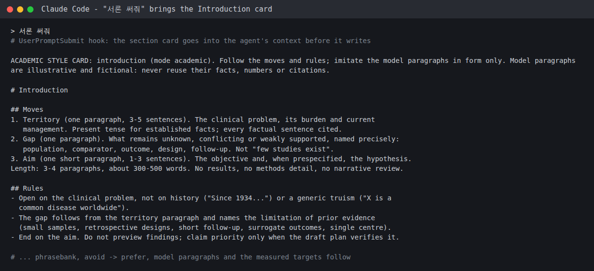
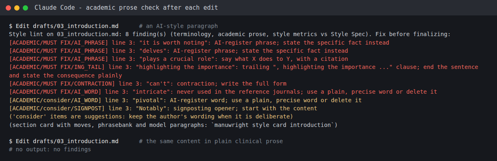
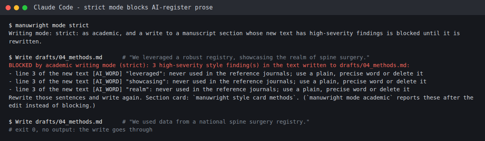
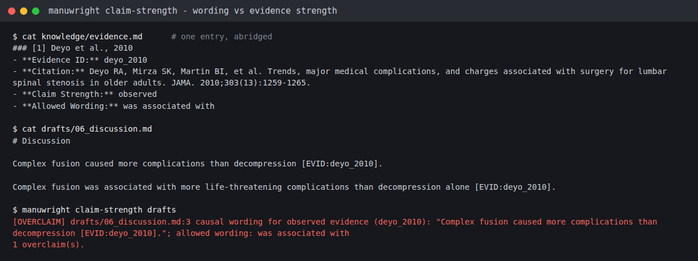
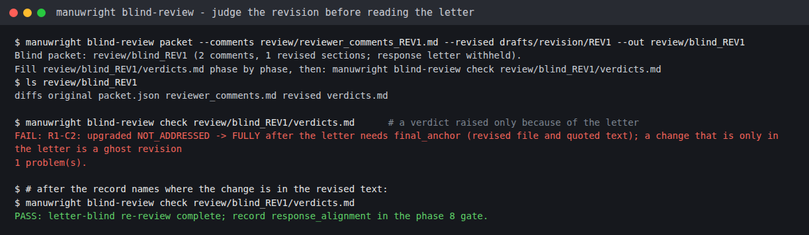
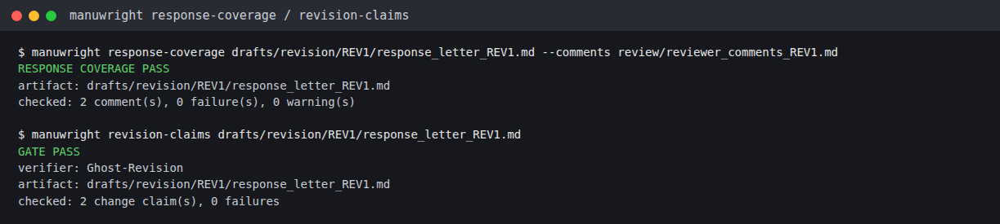

# manuwright user manual (v2.5.2)

This manual walks through one paper from an empty folder to a signed DOCX package, using the commands and outputs of a real end-to-end run on synthetic trial data (2026-09-30). Academic writing mode (section 6), evidence strength and the reference audit (section 3) and the letter-blind revision re-review (section 11) are v1.9.0 features. Rules live in [WORKFLOW.md](../WORKFLOW.md); command details in [harness_guide.md](harness_guide.md). Korean: [manual.ko.md](manual.ko.md).

Screenshots are renders of the terminals' text captured during that run (the session had no macOS screen-recording permission), so they show what the tools printed; a few long outputs are abridged and say so. The images in section 6, the claim-strength image in section 8 and the images in section 11 come from a second run with v1.9.1 in a new paper folder (2026-10-07); grey `#` lines are annotations added for the reader.


## At a glance

| You get | How it is enforced |
|---|---|
| No writing before an approved plan | Agent hooks (Claude Code, Codex) and `manuwright verify` |
| Every citation from a registered, verified source | `knowledge/evidence.md` + `manuwright citations`; sources from PubMed or your Obsidian library |
| Every number from your data | `results/*.csv` + `manuwright numbers` + result bindings (155 in the demo) |
| A reporting checklist that is really complete | Official CONSORT/STROBE/PRISMA/CARE checklist, checked by an independent reviewer |
| Review by other models, never only by the writer | Any mix of Codex, Antigravity, opencode, Muse, Claude and OpenRouter models |
| A package that matches what was reviewed and signed | sha256 snapshots; any change makes reviews and sign-off stale |
| Prose in medical-journal register, not chatbot register | Academic writing mode: section cards + a prose check after every edit (section 6) |
| No wording stronger than the evidence | `Claim Strength` in evidence.md + `manuwright claim-strength` (sections 3 and 8) |
| No retracted papers or wrong DOIs | `manuwright search audit` (section 3) |
| A revision re-review the response letter cannot steer | `manuwright blind-review` (section 11) |

## Quickstart

```sh
uv tool install git+https://github.com/grotyx/Academic_writing_c_claudecode@v1.9.2
manuwright agents install                       # plugins/skills for your agents; offers Obsidian
manuwright init my-paper && cd my-paper
manuwright target                              # this paper: target journal + Word style (menus)
manuwright search "your topic" --max 10         # or: manuwright evidence import-obsidian <citekey>
#  write data/analysis_plan.md -> author approves -> manuwright record-approval ...
#  analysis scripts -> results/*.csv -> tables;  drafts/draft_plan.md -> approval
#  draft sections with any agent ("write the Introduction": the academic style card comes with it)
manuwright style learn ~/papers/good              # (optional) learn the style of 3+ good papers
manuwright verify --project project.json --profile draft
manuwright claim-strength drafts                  # wording stronger than the evidence
manuwright search audit                           # recheck references: retractions, DOIs
manuwright packet --project project.json        # independent semantic review
manuwright critical-review --target drafts/05_results.md --out review/critical
manuwright verify --project project.json --profile submission
manuwright build --project project.json
```

## 1. Install and check

```sh
uv tool install git+https://github.com/grotyx/Academic_writing_c_claudecode@v1.9.2
manuwright doctor                  # python_supported, hooks.ok, warnings
manuwright agents install --dry-run
manuwright agents install          # Claude Code, Codex, Antigravity, opencode, Muse
```

`agents install` also offers the optional Obsidian library (section 3b). Restart Claude Code after installing or updating the plugin. The first Codex session in a folder asks you to trust the plugin hooks: choose "Trust all" for the five manuwright hooks. Template users (no install) run the same engine as `python -m harness ...` and `python scripts/<tool>.py ...` inside the cloned repository.

## 2. Start a paper

```sh
manuwright init my-paper
cd my-paper
```

`init` creates `project.json`, `data/analysis_plan.md` and `drafts/draft_plan.md` (templates, not approved), `knowledge/evidence.md`, the agent rule files (`AGENTS.md`, `CLAUDE.md`, `GEMINI.md`) and empty `results/`, `review/`, `output/`. It never overwrites a file and never approves anything. Keep real manuscripts in a private folder, not in a public clone of the template.

Put the data in `data/` (for example `data/raw_data.csv` or `.xlsx`).

## 3. Register evidence

```sh
manuwright search "minimally invasive versus open lumbar fusion randomized" --max 8
manuwright search fetch 31476471 34602458 --format evidence
```

Copy the entries into `knowledge/evidence.md` and fill the summary fields from what you actually read. Mark `Source Status: abstract-only` until you have read the full text. Only IDs registered here can be cited, as `[EVID:miller_2020_pmid31476471]`. The example entry in a new paper's evidence.md is a comment and does not count as registered.

**Evidence strength.** For each entry, record how far that paper lets you go. Entries printed by `manuwright search` carry both fields.

```text
- **Claim Strength:** observed           (speculative | observed | supported | strong)
- **Allowed Wording:** was associated with
```

| Value | Typical evidence | Wording it allows |
|---|---|---|
| `speculative` | Hypotheses, case reports, expert opinion | may, suggest |
| `observed` | Observational studies (cohort, case-control) | was associated with, observed, reported |
| `supported` | Consistent observational studies, small RCTs | showed, reduced, improved |
| `strong` | Large RCTs, meta-analyses | up to demonstrated, prevents |

The author decides the value. The `claim-strength` check in section 8 uses it; an entry left blank is not checked.

**Recheck before submission.** `manuwright search audit` re-fetches every entry with a PMID or DOI from PubMed, compares title, first author, year and journal, and flags retractions, expressions of concern and errata. It fails when an entry is retracted, points to a different paper, or has a DOI that PubMed does not know (check that one at doi.org; journals outside PubMed land here too). Entries with neither PMID nor DOI are listed as unchecked. It needs an internet connection. In chat: "recheck my references".

### 3b. Your Obsidian library (optional, recommended)

If you keep references in Obsidian with the plugin "Academic Paper Citation Manager" (PubMed import, AI summaries, citekeys), every agent can search that library while it writes. manuwright never requires it.

**Install the plugin** (skip if you already have it). `manuwright agents install` offers this when the plugin is missing; or run it yourself. It downloads the latest release into the vault you pick, enables it and, if you agree, turns on MCP access. Obsidian itself must be installed and the vault created once in Obsidian. The first time Obsidian opens that vault it asks whether to trust its plugins; allow it.


**Connect it to your agents.** `connect` asks first, skips agents that are already connected, uses each agent's own `mcp add`, and backs up any JSON settings file it edits (opencode, Muse).

```sh
manuwright obsidian status
manuwright obsidian connect            # --dry-run shows the commands, --only picks agents
```


In the demo run, Codex, Muse and opencode read the library over MCP (22,622 indexed chunks); Claude Code was already connected. Antigravity asks permission for MCP tools, which headless mode cannot grant; allow the first call in an interactive session. Obsidian must be open with MCP enabled while agents use it.


**Bring a reference into the paper.** The library is for discovery; only `knowledge/evidence.md` entries can be cited. Import by citekey: the CSL fields become the citation, the plugin's AI summary fills the summary fields, the citekey becomes the `[EVID:id]`, and the status starts as `abstract-only`. Check the summary against the paper before you rely on it.

```sh
manuwright evidence import-obsidian kirtley1985influence
```


## 4. Analysis plan, approval, analysis

1. Write `data/analysis_plan.md`: research question, population, variables, statistical methods, significance and multiplicity, missing data.
2. The author reads it and approves it, either by ticking `- [x] 사용자 승인 완료`, or by saying so in chat ("승인"). For a chat approval the agent runs `manuwright approve data/analysis_plan.md --kind analysis --approved-by "Author name" --quote "승인"`, which ticks the box, writes who/when/what next to it and records the hashed receipt. An agent never approves on its own.
3. Build the paper's analysis environment once (needs `uv`): `manuwright env`. It creates a uv-managed Python 3.12 with `data/requirements.txt` (pandas, numpy, scipy, statsmodels, matplotlib, openpyxl by default) in `~/.manuwright/envs/<paper>`, outside cloud-synced folders, and writes exact versions to `data/environment.lock.txt` for the Methods section. Run scripts with `manuwright run data/py/01_descriptive.py`. A broken system, Homebrew or pyenv Python does not matter.
4. For a box you ticked yourself, record the decision:

```sh
manuwright record-approval data/analysis_plan.md --kind analysis \
  --approved-by "Author name" --decision-reference "Meeting 2026-09-30"
```

Until then, agents cannot create analysis scripts:


5. Write the scripts in `data/py/`, write every number to `results/*.csv`, and render tables from the CSVs (never type numbers into tables). Then check:

```sh
manuwright numbers drafts/table_1.md drafts/table_2.md     # 50 tokens, 0 failures in the demo
```

A wrong value is caught with the closest true value and its location:


## 5. Draft plan and approval

Fill `drafts/draft_plan.md`: key message, tone, terminology decisions, essential references, evidence gap, claim-to-citation map, table/figure plan, introduction and discussion outlines, limitations, word counts. The author approves it the same way:

```sh
manuwright record-approval drafts/draft_plan.md --kind draft --approved-by "Author name" --decision-reference "..."
```

If the plan chooses a term that the engine registry forbids (the demo used "MIS"), give the paper its own registry: copy the engine's `Style/terminology.md` into the paper's `Style/`, edit the row, and set `"terminology": "Style/terminology.md"` in `project.json`. Both `verify` and the edit-time lint hook then use it.

## 6. Academic writing mode

This makes the agent write in the register of medical journals from the first draft. It is on by default and works only inside a paper folder (one made by `manuwright init`); in other projects it does nothing.

**Where the targets come from.** 33 openly licensed original articles from JAMA Surgery, JAMA Network Open, Lancet, BMJ and Nature, published 2019 to 2022 (before generative AI, about 179,000 words), were measured. The engine ships only numbers and short phrases shared across journals, never paper text (`docs/academic_style/reference_profile.json`).

| Measured | Example |
|---|---|
| Mean sentence length by section | 22 to 24 words in Methods and Results, 27 to 28 in Introduction and Discussion |
| Passive voice by section | Methods 63%, Results 24%, Introduction and Discussion about 30% |
| Verb choice | "used" 345 times against "utilized" once; "showed" about 5 times as often as "demonstrated" |
| Never used | delve, underscore, showcase, leverage, "it is worth noting", "plays a crucial role" |

**How it works.**
1. At session start the core card goes to the agent; it goes in again after the conversation is compacted, and to subagents.
2. A drafting request ("write the Introduction") brings that section's card: moves, phrasebank, model paragraphs, measured targets. To read one yourself: `manuwright style card introduction`.
3. After every edit to a manuscript section (`drafts/01_` to `07_`) the prose findings appear with line numbers.






*MUST FIX* items are AI register absent from the measured papers, contractions, bold in running text and chat residue: fix them. *consider* items are suggestions (long sentences, "crucial", "Notably" and the like); keep the wording when it is deliberate. A plain paragraph saying the same thing gets no findings.

**Using it from chat.** No commands to memorise.

| Say | What happens |
|---|---|
| "write the Introduction", "rewrite the Discussion", "suggest titles" | The agent reads that section's card and writes |
| "fix them" | The findings are fixed |
| "make this paragraph academic" | `/style-pass` rewrites it, then checks that no fact changed |
| "learn my style from this folder" | `manuwright style learn <folder>` |
| "learn from my edits" | `manuwright style edits` proposes rules |
| "check for overclaiming" | `manuwright claim-strength drafts` |
| "academic mode strict" / "academic mode off" / "academic mode on" | Switches the mode (for every paper) |

The switch reacts only to a short request that starts with "academic mode" (or "학술 모드"). A question ("what happens if academic mode is off?") or a statement ("I turned academic mode off") changes nothing.

**Three modes.** `manuwright mode` shows the current one.

| Mode | What it does |
|---|---|
| `academic` (default) | Cards, and findings reported after each edit |
| `strict` | A write whose new text has a *MUST FIX* finding is blocked until it is rewritten |
| `off` | No cards or prose findings; the terminology check still runs |



**Adding your style or your target journal's (optional).** Put 3 or more good papers (your own, landmark papers in your field, recent papers from the target journal; PDF, DOCX, MD or TXT) in one folder.

```sh
manuwright style learn ~/papers/good
manuwright style status
```

Sentence length, passive voice, hedging, signature phrases and model paragraphs are measured per section and added to every card. The result lives only in `~/.manuwright/library/writing/profile/` and never goes into a paper folder or git. With fewer than 3 papers it is shown on the cards for reference but does not change the checks. A run that finds no usable paper keeps what was learned before.

**Learning from your edits (optional).** After you edit an agent's draft:

```sh
manuwright style edits --git HEAD~1          # with git; otherwise: manuwright style edits ai_draft.md my_edit.md
```

Repeated word substitutions and deletions are proposed in `Style/pending_style_rules.md` (P0 = 2 or more times). Only the rules you tick move into `Style/terminology.md` with `manuwright style edits --apply`, and the checks enforce them from then on. Approve one in chat ("keep the demonstrated rule") and the agent ticks exactly that rule; it never picks on its own.

**Rewriting keeps the facts.** `manuwright style preserve original.md rewritten.md` fails if any `[EVID:id]`, number, *p* value or Table/Figure reference changed. `/style-pass` runs it for every section.

## 7. Drafting with several agents

Each agent gets one section, the same rules, and the checks to run before it finishes. The prompt used in the demo:

```text
Read AGENTS.md, drafts/draft_plan.md, data/analysis_plan.md, results/*.csv, drafts/table_*.md, knowledge/evidence.md.
Write ONLY drafts/05_results.md. Cite only [EVID:id] from evidence.md. Use only numbers from the results/tables.
The primary endpoint was not significant; never call it a trend. When done run
manuwright numbers drafts/05_results.md and manuwright citations drafts/05_results.md and fix until they pass.
```

| Agent | Section in the demo | What happened |
|---|---|---|
| Codex | Methods | Citation check PASS. Kept the plan's term "MIS" despite the lint warning (fixed in v1.8.6). |
| Antigravity (`agy`) | Results | 41/41 numbers PASS. Asks permission for every file read; approve reads inside the paper folder. |
| Muse | Introduction | Citation check PASS. |
| opencode | Discussion | Citations PASS; 10 number "failures" were literature values, all present in the cited abstracts. |


Discussion and Introduction contain numbers from other papers. Exempt those files from result-number checking with a reason, and let the semantic review check them against the cited evidence (section 8).

Only Claude Code and Codex have hooks that block a write without an approved plan. In Antigravity, opencode and Muse, `manuwright verify` is the gate.

## 8. Verify the draft

`project.json` for the demo (abridged):

```json
{
  "artifacts": ["drafts/01_title.md", "drafts/02_abstract.md", "drafts/03_introduction.md", "drafts/04_methods.md",
                "drafts/05_results.md", "drafts/06_discussion.md", "drafts/07_conclusion.md"],
  "tables": ["drafts/table_1.md", "drafts/table_2.md"],
  "abstract": "drafts/02_abstract.md",
  "numeric_artifacts": ["drafts/02_abstract.md", "drafts/05_results.md", "drafts/table_1.md", "drafts/table_2.md"],
  "numeric_exemptions": {
    "drafts/03_introduction.md": "Literature values; checked against cited evidence in semantic review.",
    "drafts/04_methods.md": "Design parameters (sample size, alpha, follow-up), not results.",
    "drafts/06_discussion.md": "Literature values from cited abstracts plus restated results."
  },
  "terminology": "Style/terminology.md",
  "review_sources": ["results/table1_baseline.csv", "results/table2_outcomes.csv", "results/group_counts.csv"]
}
```

```sh
manuwright verify --project project.json --profile draft
```


Lint findings count as failures (en dashes, `p` formatting, too many numbers in the Discussion, forbidden terms). Fix them in the text; do not weaken the registry.

Before submission, run two more checks.

```sh
manuwright lint --academic drafts      # the academic prose check over the whole manuscript (same as section 6)
manuwright claim-strength drafts       # is a cited sentence stronger than its evidence (section 3)?
```



Each sentence is graded by its strongest verb: hedged (may, suggest) < associative (was associated with) < directional (showed, reduced) < causal (demonstrated, caused). Negative findings ("showed no difference", "failed to demonstrate benefit") do not count as strong claims. The check reads verbs, so the author makes the final call.

## 9. Independent semantic review

Deterministic checks prove that a number exists in your data and that a citation exists in your registry. They cannot tell whether the sentence means the right thing. For that, build a packet and give it to a different model or a human:

```sh
manuwright packet --project project.json
```

The reviewer writes `review/semantic_review.json` (status, reviewer, `method: independent`, six checks, findings, and the packet's `dependencies` verbatim). In the demo, Codex found 13 problems no checker could see, for example "baseline characteristics were balanced" when baseline ODI was 50.6 vs 46.8, a Tian 2013 citation carrying details its abstract does not contain, and a decompression-only MCID used to judge a fusion trial.


Fix, rebuild the packet, review again. Rule 9 allows two automatic rounds; after that the decision goes to the author. In the demo, round 2 resolved 12 of 13 findings; the remaining one (the allocation mechanism could not be verified from the packet) was escalated.


Any change to a manuscript file, plan, CSV or the engine makes an existing review stale; rebuild the packet and review again.

### 9b. Multi-model critical review

The semantic review above is the gate. A critical review is extra pressure from several reviewers at once. Choose any agents and any models; set your usual mix once:

```sh
manuwright config set main-model claude-opus-5-5          # the model that writes
manuwright config set review.reviewers codex,opencode,muse,agy,openrouter
manuwright config set review.opencode-model opencode-go/kimi-k3
manuwright config set review.openrouter-models deepseek/deepseek-v4-pro,qwen/qwen3.7-max
manuwright critical-review --target drafts/05_results.md --out review/critical
# one-off mix:  --reviewers codex,agy:<model>,openrouter:<model id>
```

Local reviewers run in an empty temporary folder in read-only or plan modes, so they never touch the paper. A reviewer that uses the main writing model is marked `not_independent`. Text sent to OpenRouter models leaves your machine: get the author's consent first. In the demo, eight reviewers returned full reviews; all rejected the paper, correctly, because it is a software test with synthetic data.


## 10. Submission

```sh
manuwright verify --project project.json --profile submission
```


Submission additionally needs:

- `result_bindings`: every number in the numeric artifacts bound to a CSV cell with its outcome, group, time point and unit.
- `semantic_review` with status PASS and no open findings.
- `human_signoff`: a real person's decision, with a reference.
- `ai_usage`: which AI tools did what, reviewed by a person.
- `checklist`: the reporting checklist (CONSORT, STROBE, PRISMA, CARE) with item locations.

In the demo these took most of the effort:

- **Bindings.** 155 numbers were bound. Most matched exactly one CSV cell; the rest (for example several `120`s, `60`s and `p < 0.001`s) were assigned by reading each sentence. Keep an explicit override table keyed by file, line, number and occurrence (not by token index, which shifts when a sentence changes), and audit the automatic matches too: a unique value can still carry the wrong label. Add summary rows (for example an "All" row with n = 120) to the results instead of binding a total to an unrelated cell.
- **Checklist.** Download the current official checklist (CONSORT 2025 from the CONSORT-SPIRIT website in the demo), map every item to a location or a reason, and let the independent reviewer check it. The reviewer rejected item 26 twice until group summaries, a risk difference and a risk ratio with CIs were reported. Each new analysis needed an approved analysis-plan amendment and was labelled post hoc.
- **Review rounds.** Seven rounds in total; the last two were clean. Beyond the two automatic rounds of Rule 9, continue only with the author's decision.


Any later edit makes the review and the signoff stale, as intended. In the demo, fixing reference punctuation after signoff did exactly that; the review and signoff were redone.


Then `manuwright build --project project.json` writes the DOCX package (manuscript, title page, one file per table, `verification.json`, output hashes). It re-checks everything first and refuses stale inputs. Open the files and check them by eye before submitting.


## 11. Revision: letter-blind re-review

The steps after reviewer comments arrive. Rules in detail: [revision_guide.md](revision_guide.md).

1. Save the comments as `review/reviewer_comments_REV1.md` in this form; the numbers let the tools count every comment.

```text
Reviewer #1:
Comment 1) Please report the follow-up rate.
Comment 2) Define leg pain.
```

2. Save only the changed sections in `drafts/revision/REV1/` with `_REV1` (for example `04_methods_REV1.md`); the response letter is `response_letter_REV1.md` in the same folder. Every response that claims a manuscript change carries a `[CHANGE]` block.

```text
Comment 2) Define leg pain.

[CHANGE]
comment_id: R1-C2
claim: defined the leg pain scale anchors
section: 04_methods
expected_terms: worst pain
[/CHANGE]

Response: We thank the reviewer and defined the scale.

Revised text:
"Leg pain was measured with a 0-10 numeric rating scale (0, no pain; 10, worst pain)."
```

3. **Letter-blind re-review.** A reviewer who reads the response letter first is pulled toward the authors' account, so the verdict is recorded before the letter is seen.

```sh
manuwright blind-review packet --comments review/reviewer_comments_REV1.md \
  --revised drafts/revision/REV1 --out review/blind_REV1
```

The packet holds the comments, the original and revised sections and their diffs, and no response letter. The reviewer (another model or a person) fills `review/blind_REV1/verdicts.md` phase by phase.

| Phase | Sees | Records |
|---|---|---|
| Phase 1 | The comments only | What the manuscript must show if the comment is fully addressed (`expectation`) |
| Phase 2A | Original, revised, diffs (no letter) | A verdict (FULLY, PARTIALLY, NOT_ADDRESSED, MADE_WORSE, CANNOT_VERIFY) and where in the manuscript (`anchor`) |
| Phase 2B | Now the letter too | The final verdict; a changed verdict needs a basis (`author_pointer`, `valid_rebuttal`, `scope_correction`) and a raised one the place in the revised text (`final_anchor`) |

```sh
manuwright blind-review check review/blind_REV1/verdicts.md
```

PASS needs every comment at FULLY or PARTIALLY and no empty field. A change that exists only in the letter, not in the manuscript, does not pass. Record `response_alignment` in the phase 8 gate after this PASS.



4. **Response and revision checks.**

```sh
manuwright response-coverage drafts/revision/REV1/response_letter_REV1.md --comments review/reviewer_comments_REV1.md
manuwright revision-claims drafts/revision/REV1/response_letter_REV1.md
manuwright verify --project project.json --profile revision
```

`response-coverage` checks that every comment has a response; `revision-claims` checks that each change claimed in a `[CHANGE]` block is really in the revised section. Both returned `PASS` in testing.



## 12. Updates

```sh
manuwright update --check
manuwright update                         # installs, then runs `manuwright agents update` (--no-agents to skip)
manuwright config set auto-update on      # patch releases only, at most daily
manuwright init --refresh-rules --all     # every registered paper: update its agent rules (update offers this)
manuwright check                          # one report of what is current, with the fix for each ✗
```

`check` also shows the writing mode and whether a learned style exists. After a release that changes the agent rules (`AGENTS.md`/`CLAUDE.md`/`GEMINI.md`), such as v1.9.0, run `manuwright init --refresh-rules --all`.

Auto-update waits when a registered paper pins the engine (`"engine": ">=1.8,<1.9"` in `project.json`) or holds a fresh review that an engine change would invalidate. Roll back with `manuwright update --to <version>`.

On Windows with a uv install, `manuwright update` does not install in place (Windows cannot replace the running `manuwright.exe`); it prints the command instead. Close agent sessions and paste it into a new PowerShell window: `uv tool install --force git+https://github.com/grotyx/Academic_writing_c_claudecode@vX.Y.Z; if ($?) { manuwright agents update }` (installs, then refreshes the agent adapters). After any update, `manuwright update` lists the registered paper folders that need `manuwright init --refresh-rules`. If an earlier update left `ModuleNotFoundError: No module named 'manuwright'`, the same command repairs it.

Check that an update worked:

```sh
manuwright --version                 # CLI version and engine folder
manuwright update --check            # "(up to date)" when the newest release is installed
claude plugin marketplace list       # manuwright path = the engine folder printed by --version
codex plugin marketplace list        # same path
```

The engine folder can change on reinstall (for example `.../python3.11/site-packages/manuwright` → `.../python3.12/...`). `manuwright agents update` re-adds the Claude and Codex marketplaces from the current folder, so they never point at a deleted path. An agent that still reports a different plugin version after `agents update` needs a restart.

### Settings

`manuwright setup` walks through everything below in one pass. Models are chosen from menus, not typed: the main model is picked from a list (or "other"), and the agent reviewers (Claude Code, Codex, Muse, Antigravity/Gemini: run on your subscription, no API cost), OpenRouter models (pay per use) and opencode models (opencode Go subscription) are checklists — ↑/↓ to move, Space to tick, Enter to finish, Esc to keep the current choice, and a number key fills the checklist with a recommended set (OpenRouter: 1 balanced, 2 budget, 3 strong; opencode: 1 Go, 2 Go budget). The lists hold the newest GLM, Kimi, MiniMax, DeepSeek, Qwen, Xiaomi MiMo and Meituan LongCat models, checked against the live lists with an estimated cost per review (about $0.002–0.05 for most). Without an interactive terminal (or on Windows) the same sets are offered by number. The main-model list marks which agent CLI runs each model ("Claude Code installed", "Codex not installed") and lists models you can run first; type a number, or a model id for one not listed. An agent name such as `claude` is not a model and is refused with a hint. When OpenRouter models are chosen, setup asks for your OpenRouter API key (typed as `****`, then shown as `sk-or-v1...abcd`, checked with OpenRouter, saved owner-only in `~/.manuwright/secrets.json`; Ctrl+V pastes it, and where a terminal does not deliver the paste (Windows Terminal running PowerShell) copy the key and press Enter on the empty prompt to read it from the clipboard; an `OPENROUTER_API_KEY` environment variable takes precedence). `manuwright models` prints the same sets any time. Free and "contributor" tiers are left out because they may keep prompts, and a review sends the unpublished manuscript. It (Enter keeps a value, `-` clears it), then offers the Obsidian library. Use `manuwright config set <key> <value>` for a single change.


| Key | Meaning |
|---|---|
| `main-model` | Model that writes the manuscript; reviewers using it are flagged |
| `review.reviewers` | Default reviewers, e.g. `codex,opencode,muse,agy,openrouter` |
| `review.openrouter-models` | Models used for a bare `openrouter` reviewer |
| `review.<agent>-model` | Model for `claude`, `codex`, `opencode`, `muse` or `agy` |
| `auto-update` | `on`/`off`: automatic patch updates |
| `docx.font`, `docx.size`, `docx.line-spacing`, `docx.margin-inches`, `docx.heading-size`, `docx.subheading-size` | Your default Word style (default Times New Roman 10 pt, double spacing, 1-inch margins) |
| `docx.line-numbers`, `docx.page-numbers` | `continuous`/`page`/`off` and `center`/`right`/`off` |

`manuwright config` prints the settings; `manuwright config unset <key>` removes one.

### Per-paper settings: target journal and Word style

The reference format and the Word layout belong to each paper, not to your global settings. Inside a paper folder run:

```sh
manuwright target
```

It asks two things from menus and saves them in that paper's `project.json`: the target journal (one of the presets below, or none) and the Word style (keep, default, or this paper's own font, size, line spacing, margins, line numbers, page numbers). Other papers are not affected. Changing it after a review makes that review stale, as any `project.json` edit does. `setup` no longer asks about Word style; the `docx.*` config keys above remain only as an optional personal default.

### Personal library: Word styles, team profile, writing style

Things you reuse across papers live in one place, `~/.manuwright/library/`, whichever folder you run the command from; `manuwright library` shows what is there. Files you add are copied in, so the originals can move. A name that already exists is never overwritten unless you add `--replace`. Each paper keeps its own copy (a Word template goes to `templates/` in the paper), so changing the library later does not change existing papers.

```sh
manuwright library docx add bjj_template.docx --name bjj --journal bjj   # a Word file for one journal
manuwright library docx add lab_template.docx --name lab --team          # or a team / --personal style
manuwright library docx save bjj                                         # or: the current paper's style
manuwright library profile --edit                           # team: authors, affiliations, ORCID, funding
manuwright library profile --import profile/authors.md      # or reuse an existing one
manuwright library writing add my_2024_paper.pdf --kind own   # papers that show your writing style
manuwright library writing import Style/                      # or an existing Style/ folder
```

- **Word styles.** Word layout usually follows the target journal, so a style can be saved for a journal (`--journal`), for the team (`--team`) or as your own (`--personal`); `docx save` inside a paper links it to that paper's journal. In `manuwright target`, after you pick the journal, a style saved for that journal is listed first and preselected; team and personal styles follow. A Word template keeps its own fonts, heading styles and margins; the build drops the template's text and uses its styles. Only what you set on top (for example line numbers) is changed.
- **Team profile.** Every new paper gets a copy in `profile/authors.md`, which the title page is written from. You can also ask your agent: "Fill my manuwright team profile from this CV". It edits the library file, never guesses an ORCID or grant number, and leaves `[...]` for what it does not know.
- **Writing style.** In `manuwright library writing import Style/`, `writing` is the command and `Style/` is the folder you import from (here the Style folder of a template checkout). Turning your papers into a style needs an LLM. After `writing add`, ask your agent "register my writing style in the manuwright library". The manuwright skill follows `Style/style_guide.md`: patterns and measured numbers (sentence length, citation density), no copied paragraphs. It writes the anchors, `terminology.md` and `style_spec.md`. New papers get them in `Style/` and use them for `/style-pass` and the terminology lint. Source PDFs stay in the library.

### Journal reference style

The target journal chosen in `manuwright target` (or `"journal"` in `project.json`) makes the build write its reference format and in-text markers (superscript where the journal uses them):

```sh
manuwright format-references drafts/*.md --journal nejm --fetch   # cache full PubMed metadata once, preview the list
```

```json
"journal": "nejm"
```


With `--fetch`, JBJS (every author listed) gets all 11 authors of Nakarai 2022, where the registered citation stopped at six. NEJM cuts to three, drops the issue and abbreviates pages; adjacent tags become one superscript marker.

Presets: `vancouver`, `ama` (JAMA), `nejm`, `lancet`, `spine`, `spine-j`, `bjj`, `jbjs`, `neurospine`, `jns-spine`, `gsj`, `corr`, `asj`, `esj`. The rules of each are listed in [harness_guide.md](harness_guide.md). Check the journal's current instructions before submitting.

## 13. Troubleshooting

| Symptom | Cause and fix |
|---|---|
| A section was written without an approved plan | Hooks only exist in Claude Code and Codex. Template: upgrade to v1.8.5+ (relative hook paths failed after a `cd`). Codex: trust the plugin hooks. Others: run `manuwright verify`. |
| `Hooks need review` in Codex | New or changed plugin hooks. Review, then trust the manuwright hooks. |
| Lint flags a term your plan chose | Give the paper its own `Style/terminology.md` and set `terminology` in `project.json`. |
| `one or more declared artifacts are missing: ...` | `project.json` lists sections that do not exist yet. Edit `artifacts`. |
| Numbers in Discussion fail | Literature values: add a `numeric_exemptions` reason and have the semantic review check them. |
| Review became stale | Something in its dependencies changed. Rebuild the packet and review again. |
| Plugin/CLI version warning | Run `manuwright agents update`, then restart the agent. |
| `Obsidian MCP is unavailable` | Open the vault in Obsidian and turn on Settings > Academic Paper Citation Manager > External AI (MCP); restart the agent's MCP connection. |
| New vault does not load the plugin | Obsidian's restricted mode: allow community plugins for that vault. |
| agy returns nothing for MCP or review | Headless mode cannot grant tool permission; use agy interactively, or rely on the text-only review prompt (built in). |
| A reviewer is `not_independent` | It uses the same model as `main-model`; pick another model for that reviewer. |
| `BLOCKED by workflow gate (CLAUDE.md Rule 8): ...draft_plan.md: ...` | The end of the message names the reason: a placeholder left on a given line, approval not ticked, empty items, or the plan was edited after approval (show the change and approve again). |
| No section card or prose findings | Outside a paper folder, or the mode is `off`. Run `manuwright mode` in the paper folder. |
| `BLOCKED by academic writing mode (strict)` | A *MUST FIX* sentence in strict mode. Rewrite it, or say "academic mode on" to return to academic. |
| The mode does not change | The environment variable `MANUWRIGHT_WRITING_MODE` wins; remove it and the saved setting applies. |
| A learned style does not affect the checks | Fewer than 3 papers, or no section headings found. See `manuwright style status` and the skipped lines of learn. |
| `search audit` cannot reach PubMed | Check the internet connection and run the same command again. |
| `blind-review packet` finds no comments | Save the comments as `Reviewer #1:` followed by `Comment 1) ...`. |
