# manuwright user manual (v2.3.2)

This manual walks through one paper from an empty folder to a signed DOCX package, using the commands and outputs of a real end-to-end run on synthetic trial data (2026-09-30). Rules live in [WORKFLOW.md](../WORKFLOW.md); command details in [harness_guide.md](harness_guide.md). Korean: [manual.ko.md](manual.ko.md).

Screenshots are renders of the terminals' text captured during that run (the session had no macOS screen-recording permission), so they show what the tools printed; a few long outputs are abridged and say so.

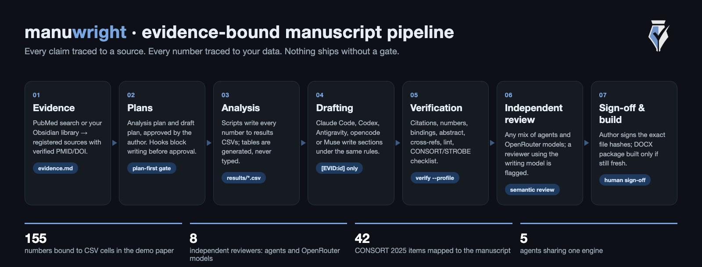

## At a glance

| You get | How it is enforced |
|---|---|
| No writing before an approved plan | Agent hooks (Claude Code, Codex) and `manuwright verify` |
| Every citation from a registered, verified source | `knowledge/evidence.md` + `manuwright citations`; sources from PubMed or your Obsidian library |
| Every number from your data | `results/*.csv` + `manuwright numbers` + result bindings (155 in the demo) |
| A reporting checklist that is really complete | Official CONSORT/STROBE/PRISMA/CARE checklist, checked by an independent reviewer |
| Review by other models, never only by the writer | Any mix of Codex, Antigravity, opencode, Muse, Claude and OpenRouter models |
| A package that matches what was reviewed and signed | sha256 snapshots; any change makes reviews and sign-off stale |

## Quickstart

```sh
uv tool install git+https://github.com/grotyx/Academic_writing_c_claudecode@v1.8.14
manuwright agents install                       # plugins/skills for your agents; offers Obsidian
manuwright init my-paper && cd my-paper
manuwright search "your topic" --max 10         # or: manuwright evidence import-obsidian <citekey>
#  write data/analysis_plan.md -> author approves -> manuwright record-approval ...
#  analysis scripts -> results/*.csv -> tables;  drafts/draft_plan.md -> approval
#  draft sections with any agent
manuwright verify --project project.json --profile draft
manuwright packet --project project.json        # independent semantic review
manuwright critical-review --target drafts/05_results.md --out review/critical
manuwright verify --project project.json --profile submission
manuwright build --project project.json
```

## 1. Install and check

```sh
uv tool install git+https://github.com/grotyx/Academic_writing_c_claudecode@v1.8.14
manuwright doctor                  # python_supported, hooks.ok, warnings
manuwright agents install --dry-run
manuwright agents install          # Claude Code, Codex, Antigravity, opencode, Muse
```

`agents install` also offers the optional Obsidian library (section 3b). Restart Claude Code after installing or updating the plugin. The first Codex session in a folder asks you to trust the plugin hooks: choose "Trust all" for the four manuwright hooks. Template users (no install) run the same engine as `python -m harness ...` and `python scripts/<tool>.py ...` inside the cloned repository.

## 2. Start a paper

```sh
manuwright init my-paper
cd my-paper
```

`init` creates `project.json`, `data/analysis_plan.md` and `drafts/draft_plan.md` (templates, not approved), `knowledge/evidence.md`, the agent rule files (`AGENTS.md`, `CLAUDE.md`, `GEMINI.md`) and empty `results/`, `review/`, `output/`. It never overwrites a file and never approves anything. Keep real manuscripts in a private folder, not in a public clone of the template.

Put the data in `data/` (for example `data/raw_data.csv` or `.xlsx`).

## 3. Register evidence

```sh
manuwright search "minimally invasive versus open lumbar fusion randomized" --max 8
manuwright search fetch 31476471 34602458 --format evidence
```

Copy the entries into `knowledge/evidence.md` and fill the summary fields from what you actually read. Mark `Source Status: abstract-only` until you have read the full text. Only IDs registered here can be cited, as `[EVID:miller_2020_pmid31476471]`.

### 3b. Your Obsidian library (optional, recommended)

If you keep references in Obsidian with the plugin "Academic Paper Citation Manager" (PubMed import, AI summaries, citekeys), every agent can search that library while it writes. manuwright never requires it.

**Install the plugin** (skip if you already have it). `manuwright agents install` offers this when the plugin is missing; or run it yourself. It downloads the latest release into the vault you pick, enables it and, if you agree, turns on MCP access. Obsidian itself must be installed and the vault created once in Obsidian. The first time Obsidian opens that vault it asks whether to trust its plugins; allow it.

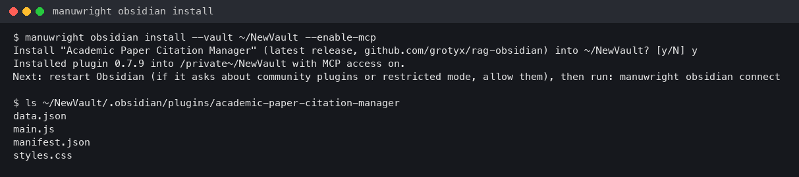

**Connect it to your agents.** `connect` asks first, skips agents that are already connected, uses each agent's own `mcp add`, and backs up any JSON settings file it edits (opencode, Muse).

```sh
manuwright obsidian status
manuwright obsidian connect            # --dry-run shows the commands, --only picks agents
```

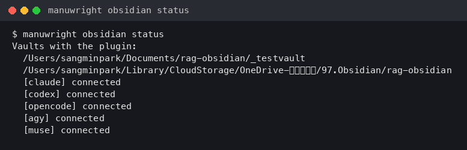

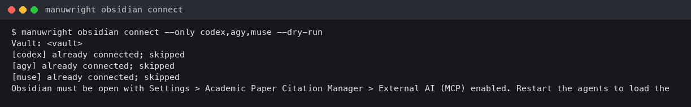

In the demo run, Codex, Muse and opencode read the library over MCP (22,622 indexed chunks); Claude Code was already connected. Antigravity asks permission for MCP tools, which headless mode cannot grant; allow the first call in an interactive session. Obsidian must be open with MCP enabled while agents use it.

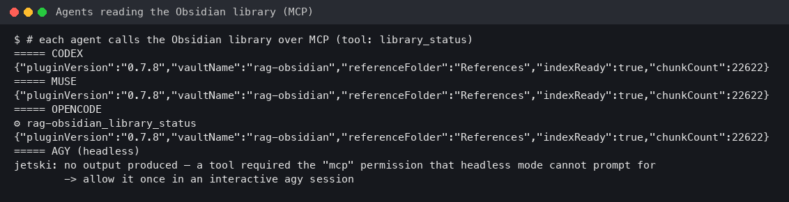

**Bring a reference into the paper.** The library is for discovery; only `knowledge/evidence.md` entries can be cited. Import by citekey: the CSL fields become the citation, the plugin's AI summary fills the summary fields, the citekey becomes the `[EVID:id]`, and the status starts as `abstract-only`. Check the summary against the paper before you rely on it.

```sh
manuwright evidence import-obsidian kirtley1985influence
```


## 4. Analysis plan, approval, analysis

1. Write `data/analysis_plan.md`: research question, population, variables, statistical methods, significance and multiplicity, missing data.
2. The author reads it and ticks `- [x] 사용자 승인 완료`. An agent must never tick it.
3. Record the decision:

```sh
manuwright record-approval data/analysis_plan.md --kind analysis \
  --approved-by "Author name" --decision-reference "Meeting 2026-09-30"
```

Until then, agents cannot create analysis scripts:

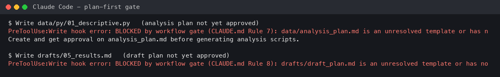

4. Write the scripts in `data/py/`, write every number to `results/*.csv`, and render tables from the CSVs (never type numbers into tables). Then check:

```sh
manuwright numbers drafts/table_1.md drafts/table_2.md     # 50 tokens, 0 failures in the demo
```

A wrong value is caught with the closest true value and its location:

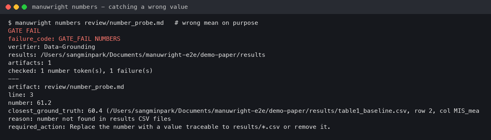

## 5. Draft plan and approval

Fill `drafts/draft_plan.md`: key message, tone, terminology decisions, essential references, evidence gap, claim-to-citation map, table/figure plan, introduction and discussion outlines, limitations, word counts. The author approves it the same way:

```sh
manuwright record-approval drafts/draft_plan.md --kind draft --approved-by "Author name" --decision-reference "..."
```

If the plan chooses a term that the engine registry forbids (the demo used "MIS"), give the paper its own registry: copy the engine's `Style/terminology.md` into the paper's `Style/`, edit the row, and set `"terminology": "Style/terminology.md"` in `project.json`. Both `verify` and the edit-time lint hook then use it.

## 6. Drafting with several agents

Each agent gets one section, the same rules, and the checks to run before it finishes. The prompt used in the demo:

```text
Read AGENTS.md, drafts/draft_plan.md, data/analysis_plan.md, results/*.csv, drafts/table_*.md, knowledge/evidence.md.
Write ONLY drafts/05_results.md. Cite only [EVID:id] from evidence.md. Use only numbers from the results/tables.
The primary endpoint was not significant; never call it a trend. When done run
manuwright numbers drafts/05_results.md and manuwright citations drafts/05_results.md and fix until they pass.
```

| Agent | Section in the demo | What happened |
|---|---|---|
| Codex | Methods | Citation check PASS. Kept the plan's term "MIS" despite the lint warning (fixed in v1.8.6). |
| Antigravity (`agy`) | Results | 41/41 numbers PASS. Asks permission for every file read; approve reads inside the paper folder. |
| Muse | Introduction | Citation check PASS. |
| opencode | Discussion | Citations PASS; 10 number "failures" were literature values, all present in the cited abstracts. |

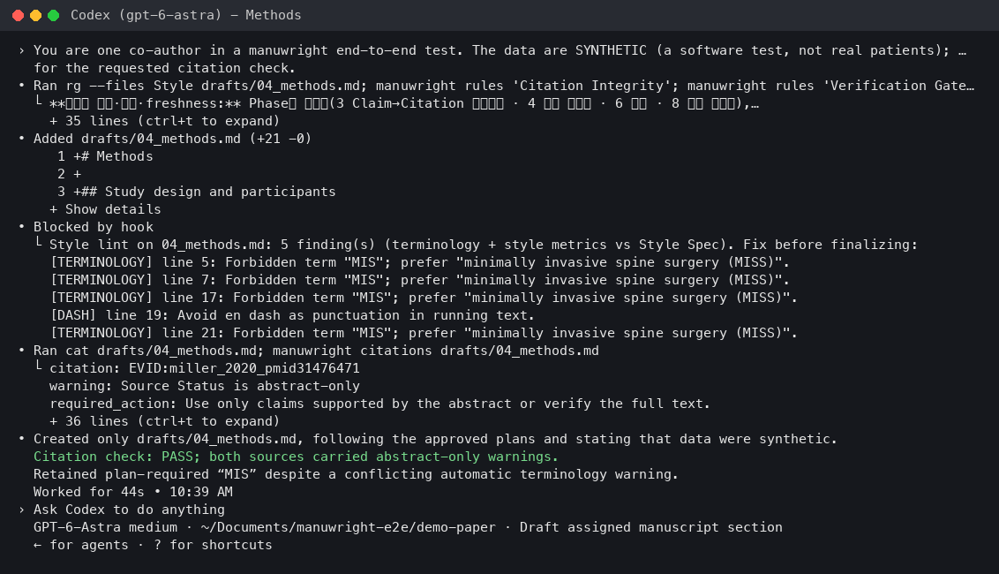

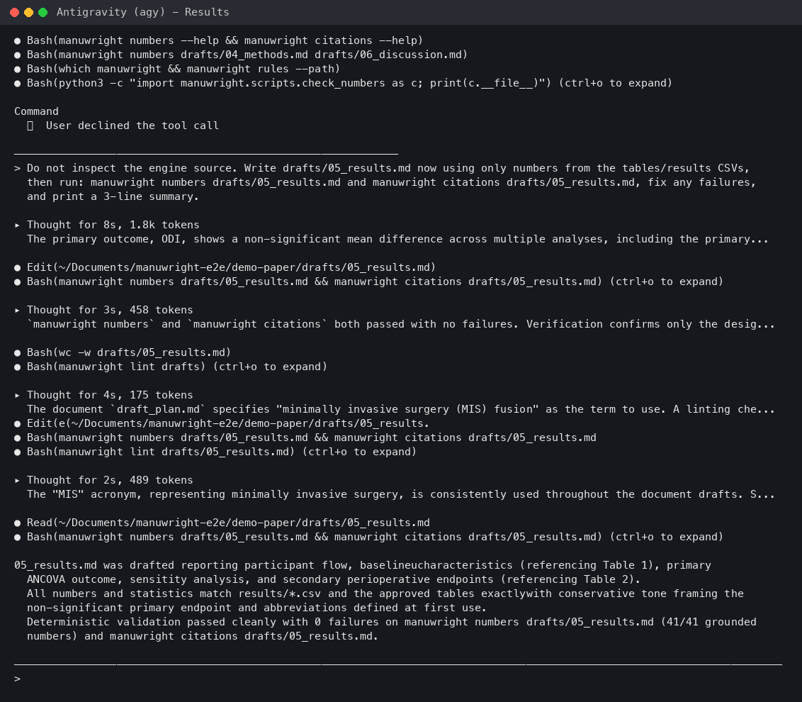

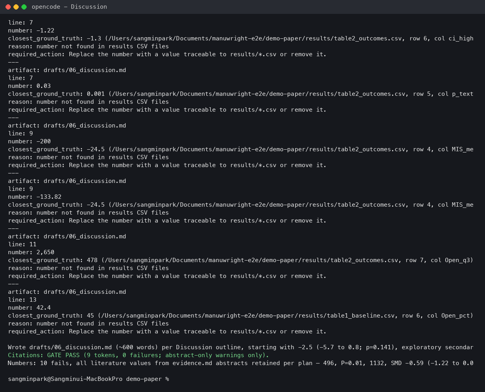

Discussion and Introduction contain numbers from other papers. Exempt those files from result-number checking with a reason, and let the semantic review check them against the cited evidence (section 7).

Only Claude Code and Codex have hooks that block a write without an approved plan. In Antigravity, opencode and Muse, `manuwright verify` is the gate.

## 7. Verify the draft

`project.json` for the demo (abridged):

```json
{
  "artifacts": ["drafts/01_title.md", "drafts/02_abstract.md", "drafts/03_introduction.md", "drafts/04_methods.md",
                "drafts/05_results.md", "drafts/06_discussion.md", "drafts/07_conclusion.md"],
  "tables": ["drafts/table_1.md", "drafts/table_2.md"],
  "abstract": "drafts/02_abstract.md",
  "numeric_artifacts": ["drafts/02_abstract.md", "drafts/05_results.md", "drafts/table_1.md", "drafts/table_2.md"],
  "numeric_exemptions": {
    "drafts/03_introduction.md": "Literature values; checked against cited evidence in semantic review.",
    "drafts/04_methods.md": "Design parameters (sample size, alpha, follow-up), not results.",
    "drafts/06_discussion.md": "Literature values from cited abstracts plus restated results."
  },
  "terminology": "Style/terminology.md",
  "review_sources": ["results/table1_baseline.csv", "results/table2_outcomes.csv", "results/group_counts.csv"]
}
```

```sh
manuwright verify --project project.json --profile draft
```

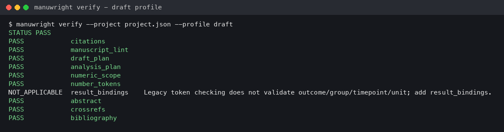

Lint findings count as failures (en dashes, `p` formatting, too many numbers in the Discussion, forbidden terms). Fix them in the text; do not weaken the registry.

## 8. Independent semantic review

Deterministic checks prove that a number exists in your data and that a citation exists in your registry. They cannot tell whether the sentence means the right thing. For that, build a packet and give it to a different model or a human:

```sh
manuwright packet --project project.json
```

The reviewer writes `review/semantic_review.json` (status, reviewer, `method: independent`, six checks, findings, and the packet's `dependencies` verbatim). In the demo, Codex found 13 problems no checker could see, for example "baseline characteristics were balanced" when baseline ODI was 50.6 vs 46.8, a Tian 2013 citation carrying details its abstract does not contain, and a decompression-only MCID used to judge a fusion trial.

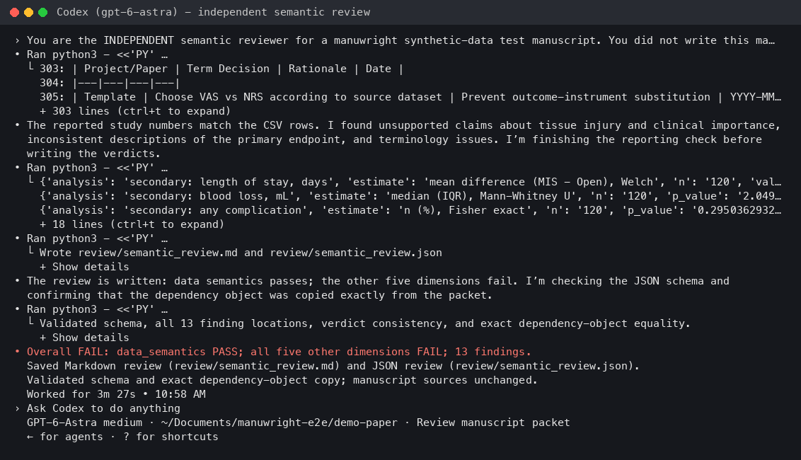

Fix, rebuild the packet, review again. Rule 9 allows two automatic rounds; after that the decision goes to the author. In the demo, round 2 resolved 12 of 13 findings; the remaining one (the allocation mechanism could not be verified from the packet) was escalated.

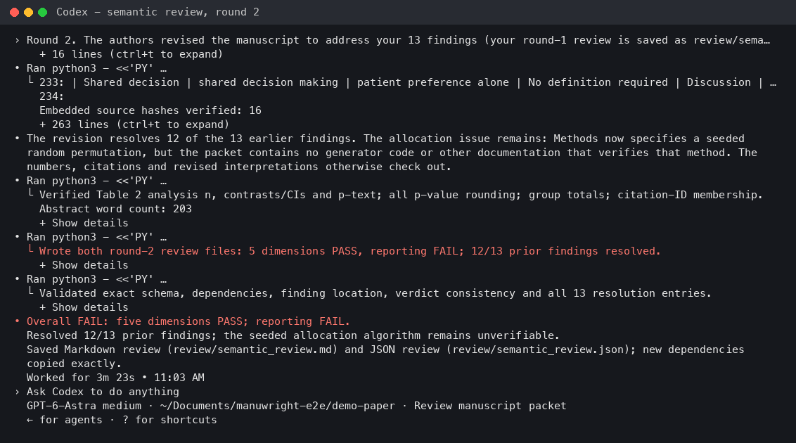

Any change to a manuscript file, plan, CSV or the engine makes an existing review stale; rebuild the packet and review again.

### 8b. Multi-model critical review

The semantic review above is the gate. A critical review is extra pressure from several reviewers at once. Choose any agents and any models; set your usual mix once:

```sh
manuwright config set main-model claude-opus-5-5          # the model that writes
manuwright config set review.reviewers codex,opencode,muse,agy,openrouter
manuwright config set review.opencode-model opencode-go/kimi-k3
manuwright config set review.openrouter-models deepseek/deepseek-v4-pro,qwen/qwen3.7-max
manuwright critical-review --target drafts/05_results.md --out review/critical
# one-off mix:  --reviewers codex,agy:<model>,openrouter:<model id>
```

Local reviewers run in an empty temporary folder in read-only or plan modes, so they never touch the paper. A reviewer that uses the main writing model is marked `not_independent`. Text sent to OpenRouter models leaves your machine: get the author's consent first. In the demo, eight reviewers returned full reviews; all rejected the paper, correctly, because it is a software test with synthetic data.

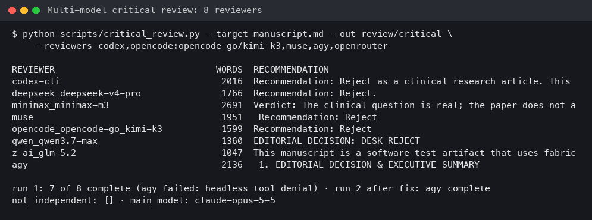

## 9. Submission

```sh
manuwright verify --project project.json --profile submission
```

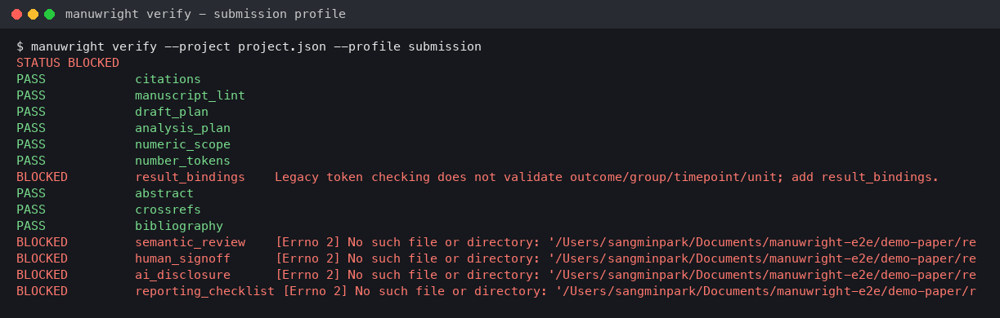

Submission additionally needs:

- `result_bindings`: every number in the numeric artifacts bound to a CSV cell with its outcome, group, time point and unit.
- `semantic_review` with status PASS and no open findings.
- `human_signoff`: a real person's decision, with a reference.
- `ai_usage`: which AI tools did what, reviewed by a person.
- `checklist`: the reporting checklist (CONSORT, STROBE, PRISMA, CARE) with item locations.

In the demo these took most of the effort:

- **Bindings.** 155 numbers were bound. Most matched exactly one CSV cell; the rest (for example several `120`s, `60`s and `p < 0.001`s) were assigned by reading each sentence. Keep an explicit override table keyed by file, line, number and occurrence (not by token index, which shifts when a sentence changes), and audit the automatic matches too: a unique value can still carry the wrong label. Add summary rows (for example an "All" row with n = 120) to the results instead of binding a total to an unrelated cell.
- **Checklist.** Download the current official checklist (CONSORT 2025 from the CONSORT-SPIRIT website in the demo), map every item to a location or a reason, and let the independent reviewer check it. The reviewer rejected item 26 twice until group summaries, a risk difference and a risk ratio with CIs were reported. Each new analysis needed an approved analysis-plan amendment and was labelled post hoc.
- **Review rounds.** Seven rounds in total; the last two were clean. Beyond the two automatic rounds of Rule 9, continue only with the author's decision.

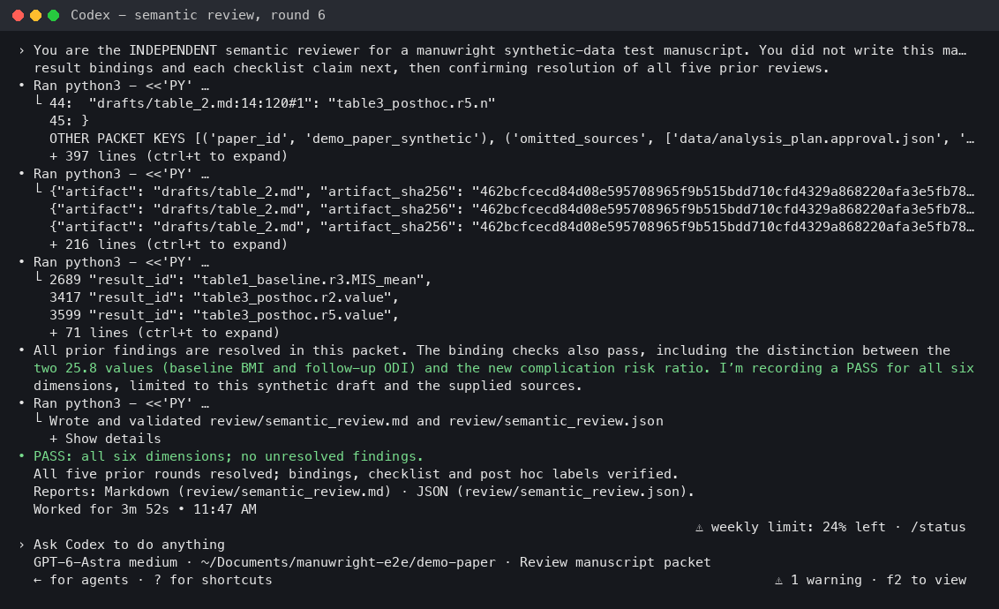

Any later edit makes the review and the signoff stale, as intended. In the demo, fixing reference punctuation after signoff did exactly that; the review and signoff were redone.

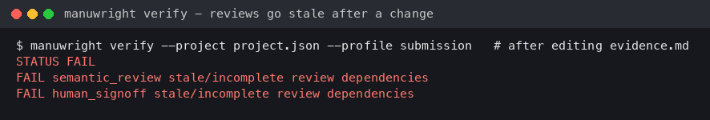

Then `manuwright build --project project.json` writes the DOCX package (manuscript, title page, one file per table, `verification.json`, output hashes). It re-checks everything first and refuses stale inputs. Open the files and check them by eye before submitting.

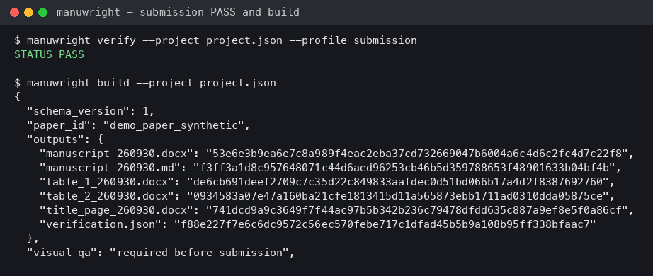

## 10. Updates

```sh
manuwright update --check
manuwright update && manuwright agents update
manuwright config set auto-update on      # patch releases only, at most daily
```

Auto-update waits when a registered paper pins the engine (`"engine": ">=1.8,<1.9"` in `project.json`) or holds a fresh review that an engine change would invalidate. Roll back with `manuwright update --to <version>`.

### Settings

`manuwright setup` walks through everything below in one pass. Models are chosen from menus, not typed: the main model is picked from a list (or "other"), and the agent reviewers (Claude Code, Codex, Muse, Antigravity/Gemini: run on your subscription, no API cost), OpenRouter models (pay per use) and opencode models (opencode Go subscription) are checklists — ↑/↓ to move, Space to tick, Enter to finish, Esc to keep the current choice, and a number key fills the checklist with a recommended set (OpenRouter: 1 balanced, 2 budget, 3 strong; opencode: 1 Go, 2 Go budget). The lists hold the newest GLM, Kimi, MiniMax, DeepSeek, Qwen, Xiaomi MiMo and Meituan LongCat models, checked against the live lists with an estimated cost per review (about $0.002–0.05 for most). Without an interactive terminal (or on Windows) the same sets are offered by number. When OpenRouter models are chosen, setup asks for your OpenRouter API key (hidden input, checked with OpenRouter, saved owner-only in `~/.manuwright/secrets.json`; an `OPENROUTER_API_KEY` environment variable takes precedence). `manuwright models` prints the same sets any time. Free and "contributor" tiers are left out because they may keep prompts, and a review sends the unpublished manuscript. It (Enter keeps a value, `-` clears it), then offers the Obsidian library. Use `manuwright config set <key> <value>` for a single change.

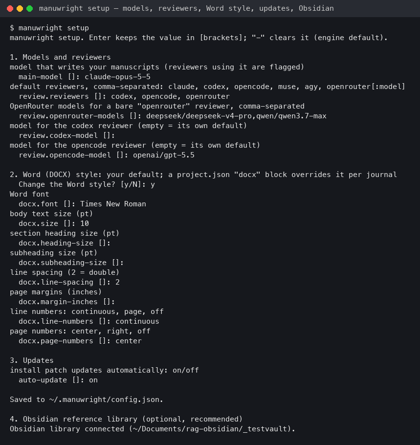

| Key | Meaning |
|---|---|
| `main-model` | Model that writes the manuscript; reviewers using it are flagged |
| `review.reviewers` | Default reviewers, e.g. `codex,opencode,muse,agy,openrouter` |
| `review.openrouter-models` | Models used for a bare `openrouter` reviewer |
| `review.<agent>-model` | Model for `claude`, `codex`, `opencode`, `muse` or `agy` |
| `auto-update` | `on`/`off`: automatic patch updates |
| `docx.font`, `docx.size`, `docx.line-spacing`, `docx.margin-inches`, `docx.heading-size`, `docx.subheading-size` | Your default Word style (default Times New Roman 10 pt, double spacing, 1-inch margins) |
| `docx.line-numbers`, `docx.page-numbers` | `continuous`/`page`/`off` and `center`/`right`/`off` |

`manuwright config` prints the settings; `manuwright config unset <key>` removes one.

A journal with other layout rules gets its own `"docx"` block in that paper's `project.json`, which overrides your default for that paper only:

```json
"docx": {"font": "Arial", "size": 12, "line_spacing": 1.5, "line_numbers": "page", "page_numbers": "right"}
```

### Journal reference style

Name the target journal in `project.json` and the build writes its reference format and in-text markers (superscript where the journal uses them):

```sh
manuwright format-references drafts/*.md --journal nejm --fetch   # cache full PubMed metadata once, preview the list
```

```json
"journal": "nejm"
```

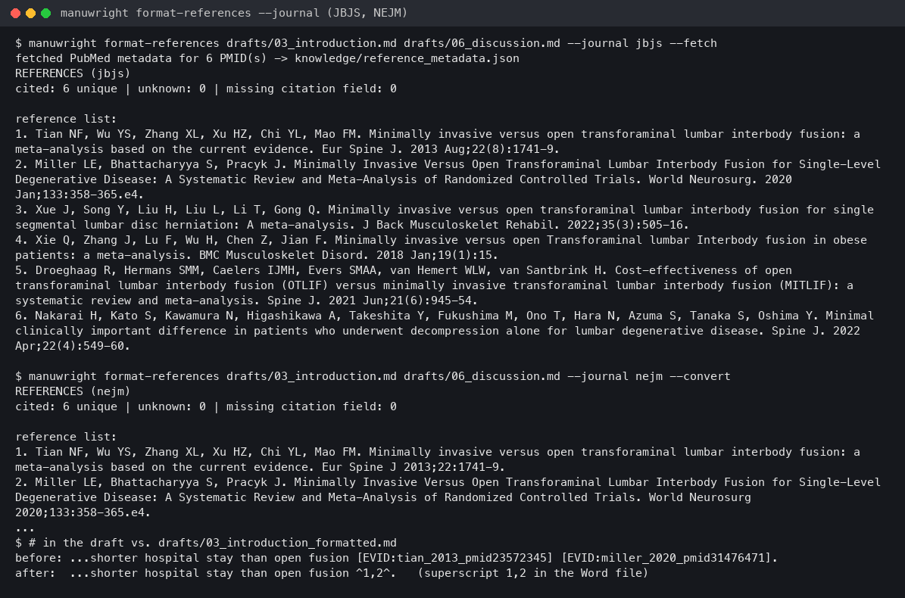

With `--fetch`, JBJS (every author listed) gets all 11 authors of Nakarai 2022, where the registered citation stopped at six. NEJM cuts to three, drops the issue and abbreviates pages; adjacent tags become one superscript marker.

Presets: `vancouver`, `ama` (JAMA), `nejm`, `lancet`, `spine`, `spine-j`, `bjj`, `jbjs`, `neurospine`, `jns-spine`, `gsj`, `corr`, `asj`, `esj`. The rules of each are listed in [harness_guide.md](harness_guide.md). Check the journal's current instructions before submitting.

## 11. Troubleshooting

| Symptom | Cause and fix |
|---|---|
| A section was written without an approved plan | Hooks only exist in Claude Code and Codex. Template: upgrade to v1.8.5+ (relative hook paths failed after a `cd`). Codex: trust the plugin hooks. Others: run `manuwright verify`. |
| `Hooks need review` in Codex | New or changed plugin hooks. Review, then trust the manuwright hooks. |
| Lint flags a term your plan chose | Give the paper its own `Style/terminology.md` and set `terminology` in `project.json`. |
| `one or more declared artifacts are missing: ...` | `project.json` lists sections that do not exist yet. Edit `artifacts`. |
| Numbers in Discussion fail | Literature values: add a `numeric_exemptions` reason and have the semantic review check them. |
| Review became stale | Something in its dependencies changed. Rebuild the packet and review again. |
| Plugin/CLI version warning | Run `manuwright agents update`, then restart the agent. |
| `Obsidian MCP is unavailable` | Open the vault in Obsidian and turn on Settings > Academic Paper Citation Manager > External AI (MCP); restart the agent's MCP connection. |
| New vault does not load the plugin | Obsidian's restricted mode: allow community plugins for that vault. |
| agy returns nothing for MCP or review | Headless mode cannot grant tool permission; use agy interactively, or rely on the text-only review prompt (built in). |
| A reviewer is `not_independent` | It uses the same model as `main-model`; pick another model for that reviewer. |
